## Languages

- [English](#blm-3510--artificial-intelligence-project)
- [Türkçe](#blm-3510--yapay-zeka-projesi)

---

<div align="center">

# BLM 3510 — Artificial Intelligence Project

### CNN-Based Binary Matrix Analysis

**Yıldız Technical University — Department of Computer Engineering**

---

</div>

## Table of Contents

1. [Data Generation](#1-data-generation)
2. [Neural Network Model](#2-neural-network-model)
3. [Hyperparameter Optimization](#3-hyperparameter-optimization)
4. [Results](#4-results)
   - [Problem A — Minimum Manhattan Distance](#problem-a--minimum-manhattan-distance)
   - [Problem B — Maximum Manhattan Distance](#problem-b--maximum-manhattan-distance)
   - [Problem C — Point Count Estimation](#problem-c--point-count-estimation)
   - [Problem D — Odd / Even Classification](#problem-d--odd--even-classification)
   - [Problem E — Corner Distance](#problem-e--corner-distance)
5. [Conclusion](#5-conclusion)
6. [Technologies](#6-technologies)

---

## Overview

This project develops CNN-based neural network models operating on 25×25 binary matrices. Five distinct problems were defined, datasets were generated, models were trained with hyperparameter optimization, and test results were evaluated.

The goal is to examine how well neural networks can learn different types of geometric and numerical problems from binary matrix inputs, where `1` represents points and `0` represents empty cells.

| Problem | Description | Type |
| ------- | ----------- | ---- |
| A | Minimum Manhattan distance between the closest pair among 5 fixed points | Regression |
| B | Maximum Manhattan distance between the farthest pair among 5 fixed points | Regression |
| C | Estimation of point count (1–10 points) | Classification |
| D | Odd/even classification of point count | Classification |
| E | Manhattan distance from the nearest point to the top-left corner (if odd count) or bottom-right corner (if even count) | Regression |

---

## 1. Data Generation

Data was generated using a C program. For each problem, 25×25 binary matrices were created and the corresponding output was computed and saved to CSV files.

Each data row has the following structure:

```text
{matrix, output}
```

### Problems A and B

For Problems A and B, 5 points are randomly placed in each matrix with no duplicate positions. Problem A computes the minimum Manhattan distance between the closest pair, while Problem B computes the maximum Manhattan distance between the farthest pair.

Manhattan distance is calculated as:

```text
|x1 - x2| + |y1 - y2|
```

10 million random samples were generated for these problems. However, since extreme values have very low probability of occurring, an equal number of samples could not be obtained across the full theoretical range. Therefore, datasets were filtered and normalized to specific ranges.

| Problem | Value Range | Samples per Range | Total Samples |
| ------- | ----------: | ----------------: | ------------: |
| A       |        1–17 |               200 |         3,400 |
| B       |        7–48 |               200 |         8,400 |

<p align="center">
  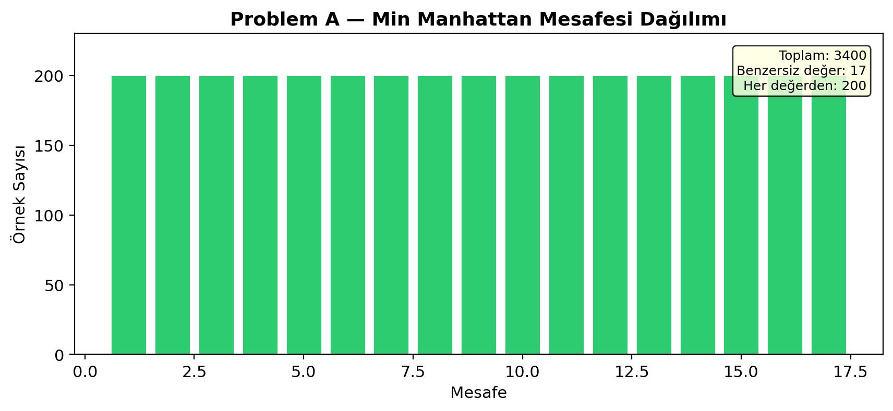
</p>
<p align="center"><em>Figure 1: Problem A — Output Value Distribution</em></p>

<p align="center">
  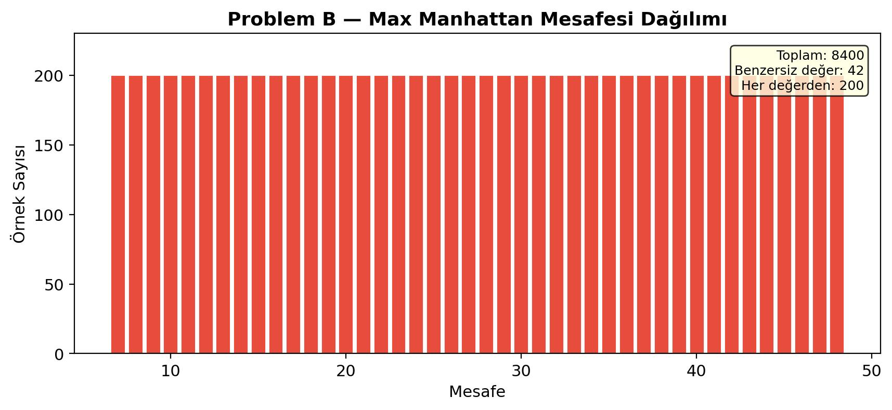
</p>
<p align="center"><em>Figure 2: Problem B — Output Value Distribution</em></p>

<p align="center">
  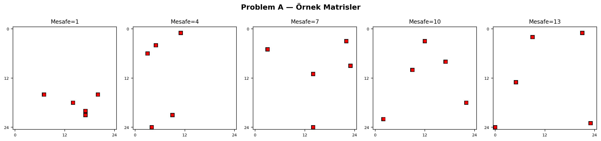
</p>
<p align="center"><em>Figure 3: Problem A — Sample Matrices</em></p>

<p align="center">
  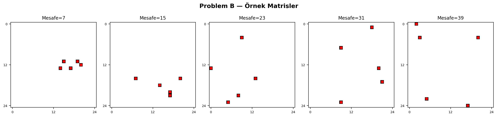
</p>
<p align="center"><em>Figure 4: Problem B — Sample Matrices</em></p>

### Problems C, D, and E

For Problems C, D, and E, the number of points varies between 1 and 10. Since sufficient data could be generated across all value ranges, no additional filtering was applied.

| Problem | Value Range | Samples per Range | Total Samples |
| ------- | ----------: | ----------------: | ------------: |
| C       |        1–10 |               500 |         5,000 |
| D       |         0–1 |             1,000 |         2,000 |
| E       |        1–48 |               200 |         9,600 |

<p align="center">
  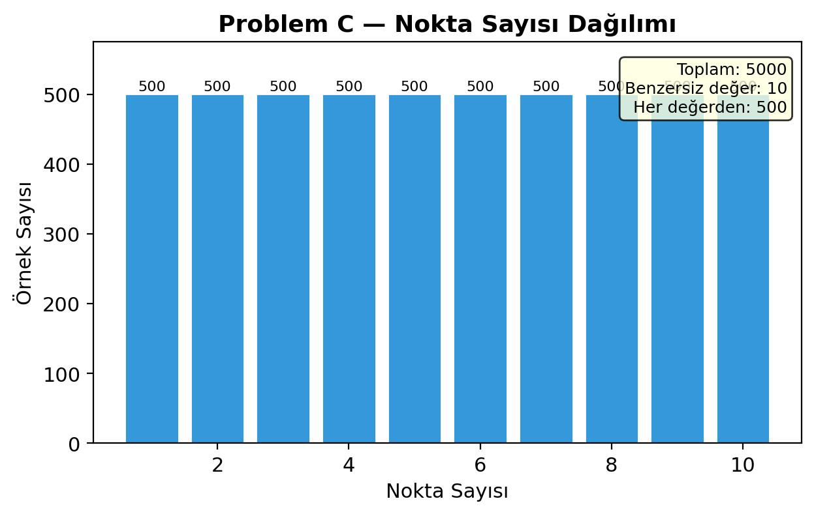
</p>
<p align="center"><em>Figure 5: Problem C — Output Value Distribution</em></p>

<p align="center">
  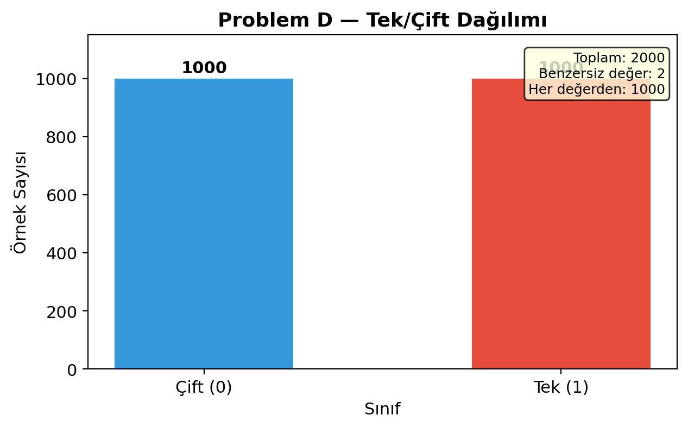
</p>
<p align="center"><em>Figure 6: Problem D — Output Value Distribution</em></p>

<p align="center">
  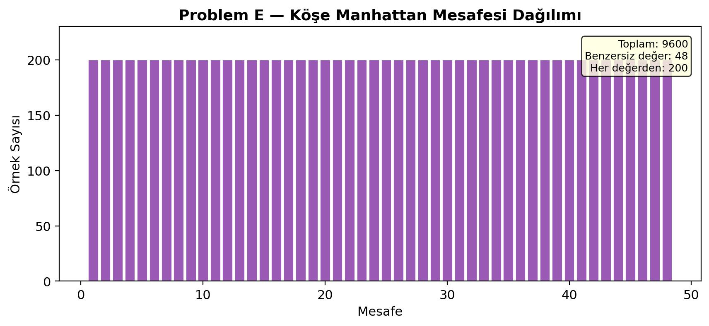
</p>
<p align="center"><em>Figure 7: Problem E — Output Value Distribution</em></p>

<p align="center">
  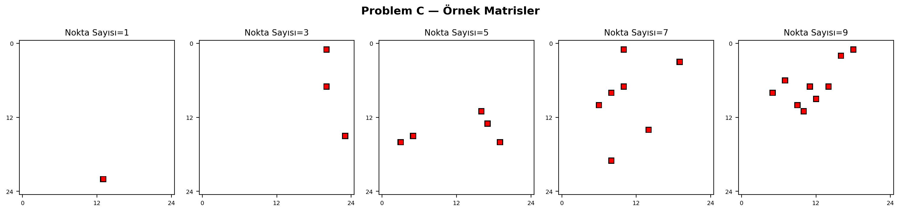
</p>
<p align="center"><em>Figure 8: Problem C — Sample Matrices</em></p>

<p align="center">
  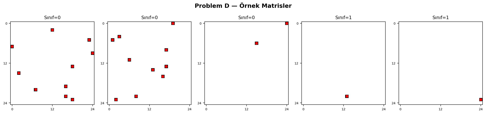
</p>
<p align="center"><em>Figure 9: Problem D — Sample Matrices</em></p>

<p align="center">
  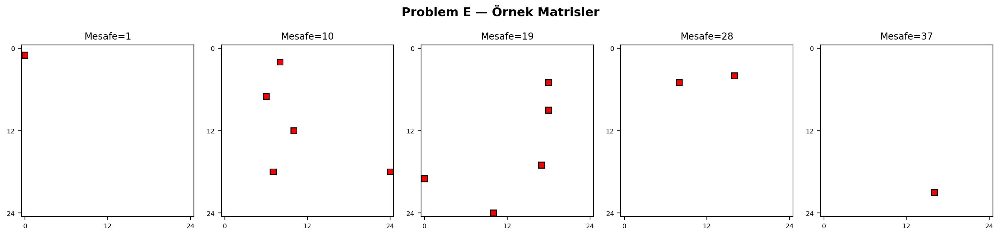
</p>
<p align="center"><em>Figure 10: Problem E — Sample Matrices</em></p>

### Train / Test Split

Datasets were split into 80% training and 20% test. No separate test data was generated.

Additionally, models were trained using different proportions of the training data:

- 25% of training data
- 50% of training data
- 100% of training data

| Problem | Total Data | Training | Test | 25% Train | 50% Train | 100% Train |
| ------- | ---------: | -------: | ---: | --------: | --------: | ---------: |
| A       |      3,400 |    2,720 |  680 |       680 |     1,360 |      2,720 |
| B       |      8,400 |    6,720 | 1,680 |     1,680 |     3,360 |      6,720 |
| C       |      5,000 |    4,000 | 1,000 |     1,000 |     2,000 |      4,000 |
| D       |      2,000 |    1,600 |  400 |       400 |       800 |      1,600 |
| E       |      9,600 |    7,680 | 1,920 |     1,920 |     3,840 |      7,680 |

<p align="center">
  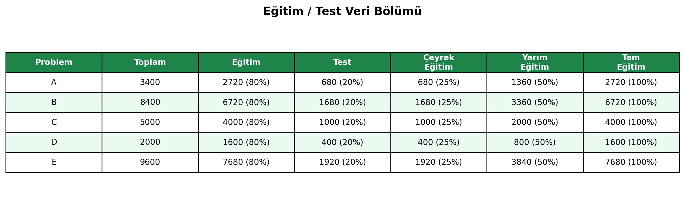
</p>
<p align="center"><em>Figure 11: Train / Test Split Overview</em></p>

<p align="center">
  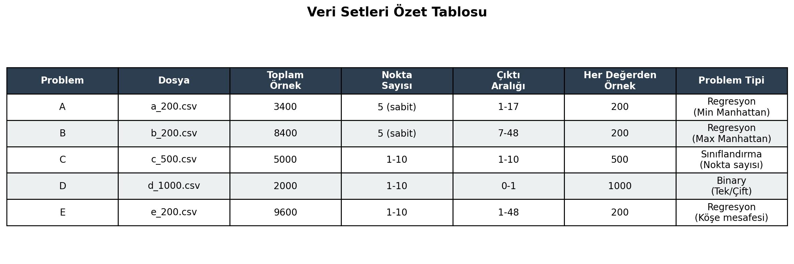
</p>
<p align="center"><em>Figure 12: Dataset Summary Table</em></p>

---

## 2. Neural Network Model

Since the input data is a two-dimensional matrix, a CNN architecture was chosen. The same base CNN architecture was used for all problems, with only the output layer modified according to the problem type.

| Layer | Description |
| ----- | ----------- |
| Input | 25×25 binary matrix |
| Conv2D | First feature extraction layer |
| BatchNorm + ReLU | Normalization and activation |
| MaxPool2D | Spatial downsampling |
| Conv2D | Second feature extraction layer |
| BatchNorm + ReLU | Normalization and activation |
| MaxPool2D | Spatial downsampling |
| Flatten | Flatten to 1D |
| Linear + ReLU + Dropout | Fully connected layer |
| Linear | Output layer |

### Output Layers and Loss Functions

| Problem | Output Layer | Loss Function |
| ------- | ------------ | ------------- |
| A, B, E | 1 neuron | MSELoss |
| C | 10 neurons | CrossEntropyLoss |
| D | 1 neuron | BCEWithLogitsLoss |

---

## 3. Hyperparameter Optimization

Grid Search was used for hyperparameter optimization. Training data was further split internally into 80% training and 20% validation.

Each configuration was trained for a set number of epochs and the best hyperparameters were selected based on validation performance.

### Search Space

| Parameter | Values |
| --------- | ------ |
| Learning Rate | 0.001, 0.0005, 0.0001 |
| Batch Size | 32, 64 |
| Conv Filters | (32, 64), (64, 128) |
| FC Size | 128, 256 |

A total of 8 different configurations were tested for each problem.

### Selection Criteria

| Problem Type | Selection Criterion |
| ------------ | ------------------- |
| Regression | Lowest MAE |
| Classification | Highest Accuracy |

### Training Settings

| Parameter | Search Phase | Training Phase |
| --------- | -----------: | -------------: |
| Epochs | 20 | 150 |
| Early Stopping Patience | 10 | 20 |
| Optimizer | Adam | Adam |

Early Stopping was used to prevent overfitting. 10% of training data was set aside for validation.

### Best Hyperparameters

| Problem | Learning Rate | Batch Size | Conv Filters | FC Size |
| ------- | ------------: | ---------: | ------------ | ------: |
| A | 0.001 | 32 | (64, 128) | 256 |
| B | 0.0001 | 32 | (32, 64) | 256 |
| C | 0.001 | 64 | (64, 128) | 128 |
| D | 0.0001 | 64 | (64, 128) | 128 |
| E | 0.001 | 32 | (32, 64) | 128 |

---

## 4. Results

### Problem A — Minimum Manhattan Distance

| Training Ratio | Training Samples | Epochs | MAE | RMSE | R² |
| -------------- | ---------------: | -----: | --: | ---: | -: |
| 25% | 612 | 38 | 2.360 | 2.934 | 0.641 |
| 50% | 1,224 | 54 | 1.752 | 2.197 | 0.799 |
| 100% | 2,448 | 84 | 1.414 | 1.772 | 0.869 |

The model was able to learn the minimum Manhattan distance problem at an acceptable level. Prediction performance improved consistently as training data increased.

The model produced better results particularly in the 1–2 distance range. This is because close point pairs are more easily captured by CNN filters.

At larger distances, the number of possible point placements increases, leading to higher variance and more difficult predictions.

<p align="center">
  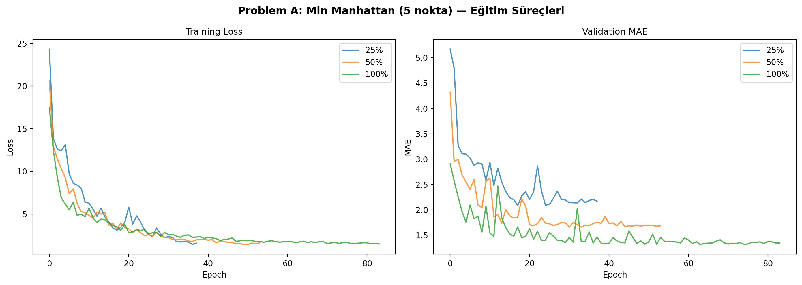
</p>
<p align="center"><em>Figure 13: Problem A — Training Curves</em></p>

<p align="center">
  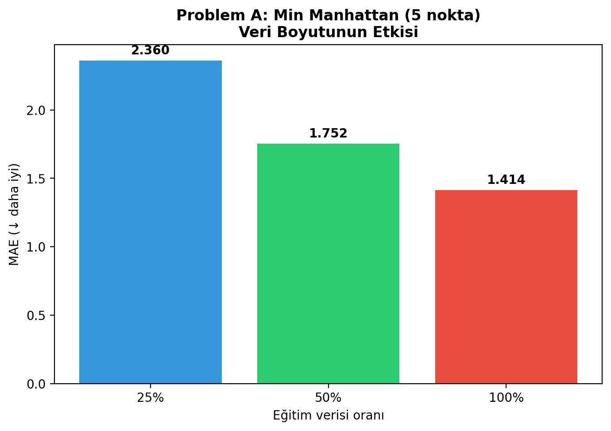
</p>
<p align="center"><em>Figure 14: Problem A — Performance by Training Ratio</em></p>

<p align="center">
  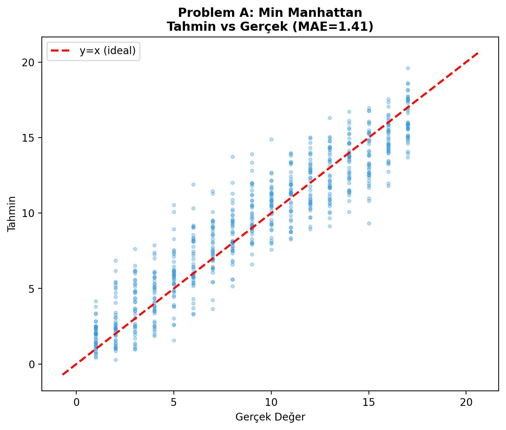
</p>
<p align="center"><em>Figure 15: Problem A — Predicted vs. Actual Values</em></p>

<p align="center">
  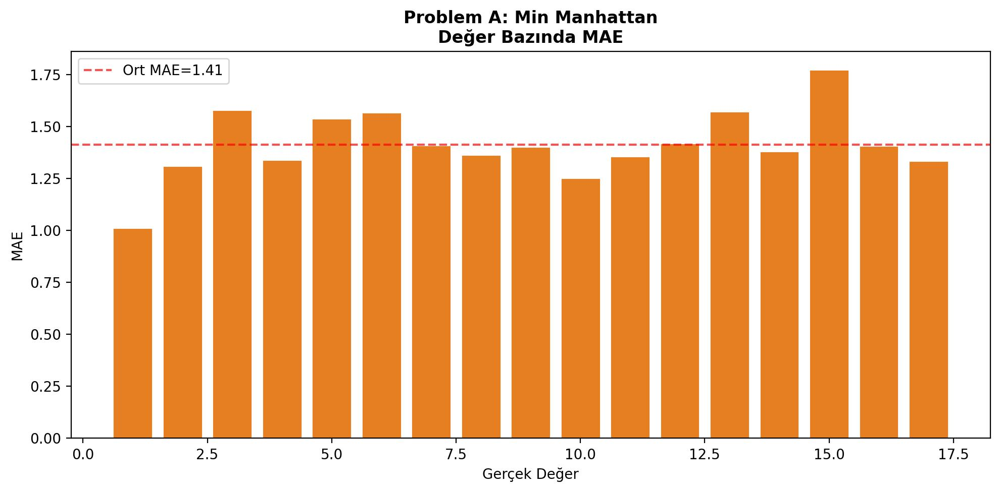
</p>
<p align="center"><em>Figure 16: Problem A — MAE by Target Value</em></p>

<p align="center">
  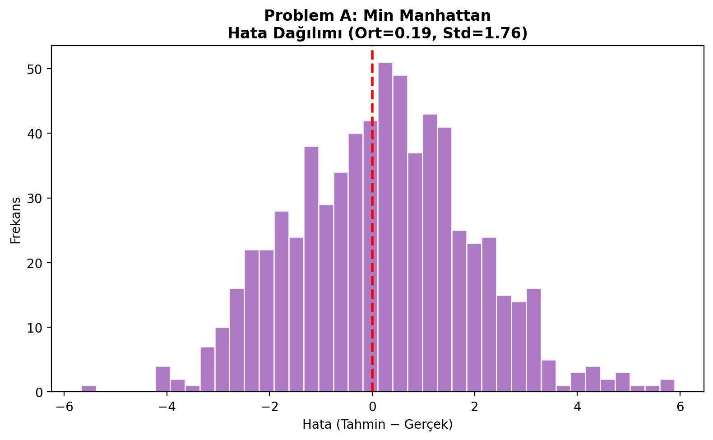
</p>
<p align="center"><em>Figure 17: Problem A — Error Distribution</em></p>

<p align="center">
  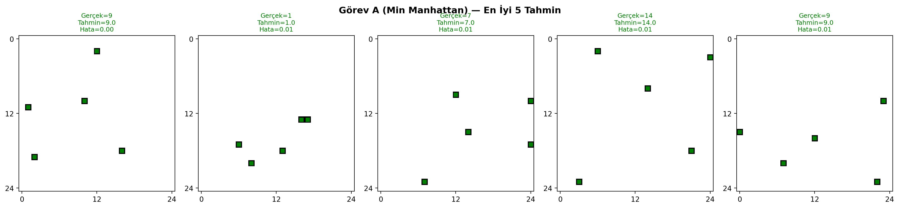
</p>
<p align="center"><em>Figure 18: Problem A — Best Predictions</em></p>

<p align="center">
  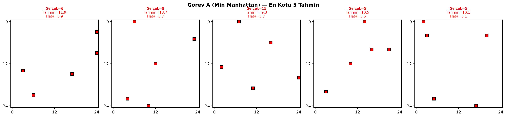
</p>
<p align="center"><em>Figure 19: Problem A — Worst Predictions</em></p>

---

### Problem B — Maximum Manhattan Distance

| Training Ratio | Training Samples | Epochs | MAE | RMSE | R² |
| -------------- | ---------------: | -----: | --: | ---: | -: |
| 25% | 1,512 | 75 | 2.431 | 3.124 | 0.934 |
| 50% | 3,024 | 74 | 1.890 | 2.404 | 0.961 |
| 100% | 6,048 | 60 | 1.648 | 2.118 | 0.969 |

In Problem B, the model produced more balanced results compared to Problem A. This is because for maximum Manhattan distance, it is generally sufficient for the model to detect the outermost points.

MAE decreased as training data increased, and the model's performance improved.

The worst predictions showed errors in the range of 6.8–8.6. There was no systematic bias — the model both overestimated and underestimated.

<p align="center">
  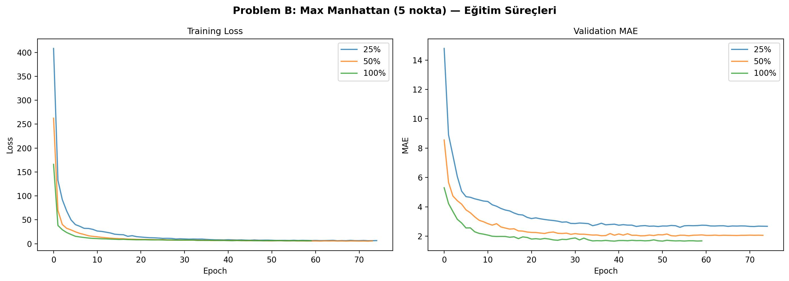
</p>
<p align="center"><em>Figure 20: Problem B — Training Curves</em></p>

<p align="center">
  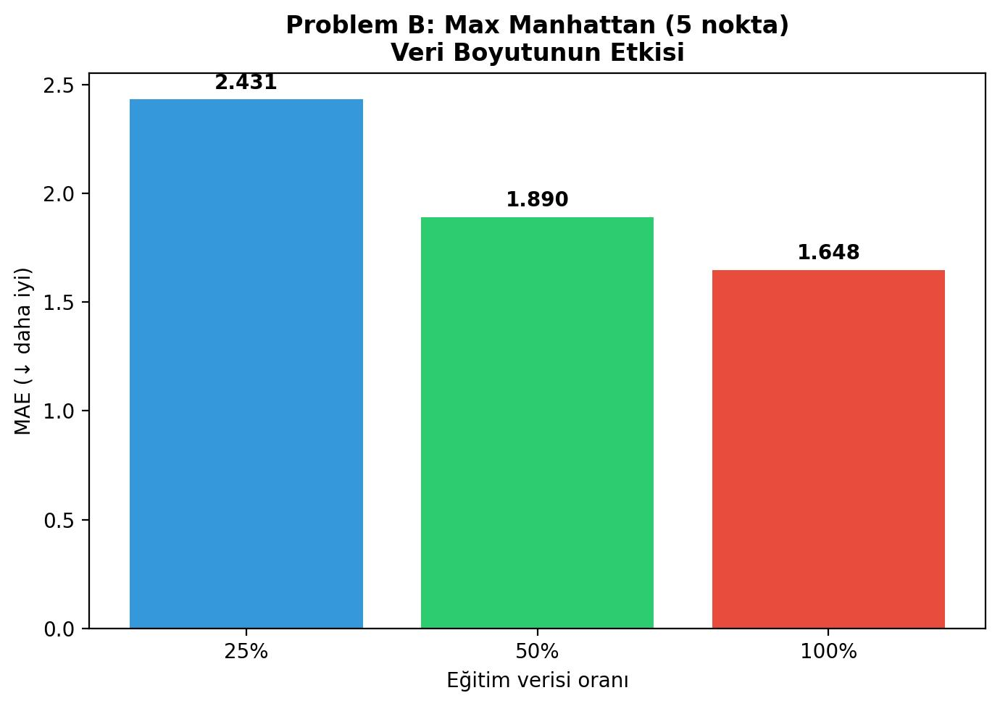
</p>
<p align="center"><em>Figure 21: Problem B — Performance by Training Ratio</em></p>

<p align="center">
  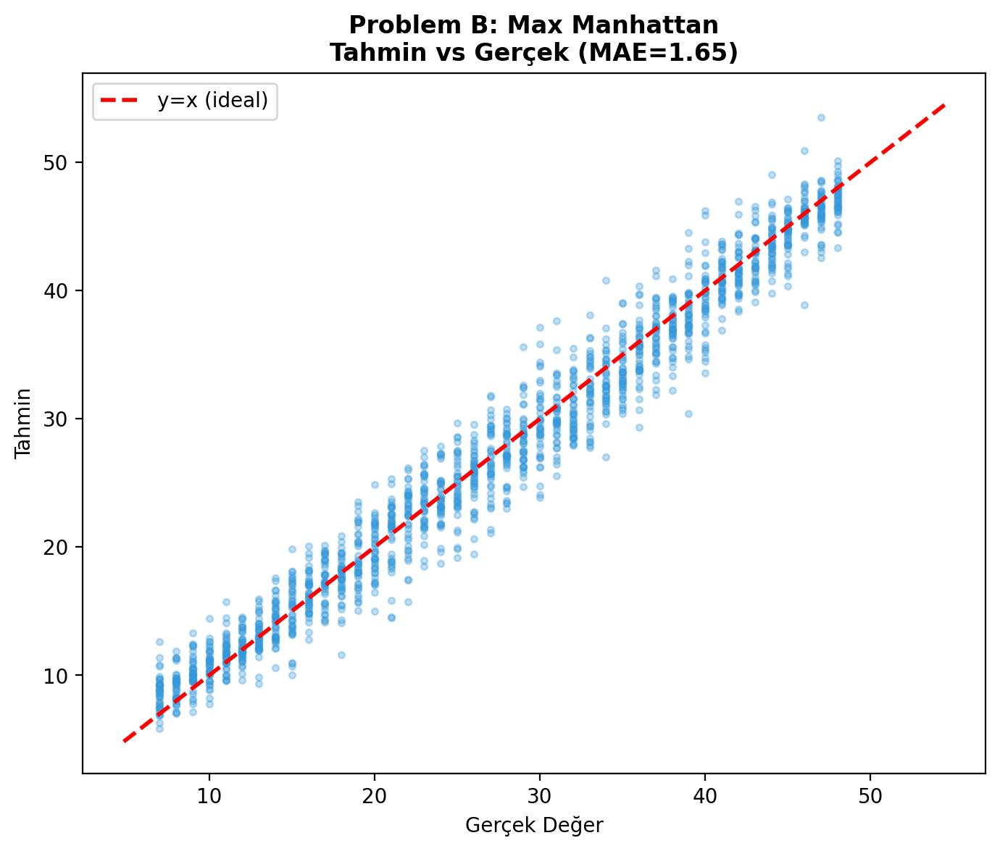
</p>
<p align="center"><em>Figure 22: Problem B — Predicted vs. Actual Values</em></p>

<p align="center">
  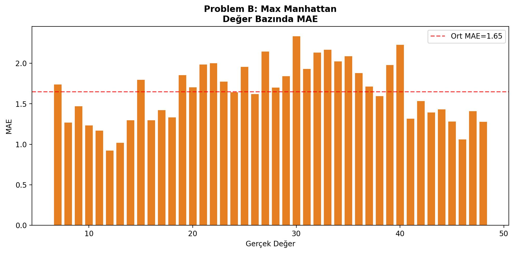
</p>
<p align="center"><em>Figure 23: Problem B — MAE by Target Value</em></p>

<p align="center">
  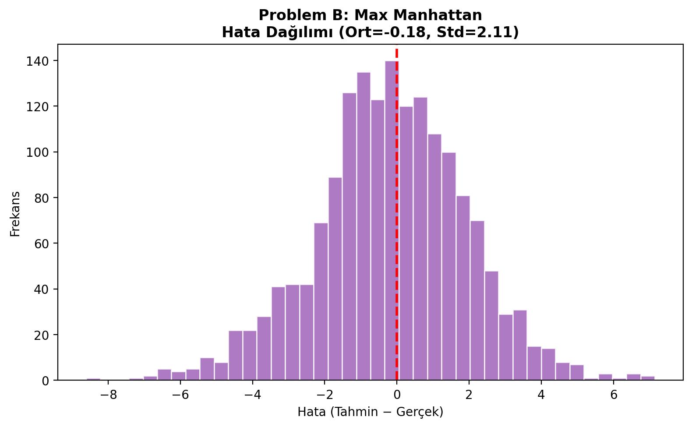
</p>
<p align="center"><em>Figure 24: Problem B — Error Distribution</em></p>

<p align="center">
  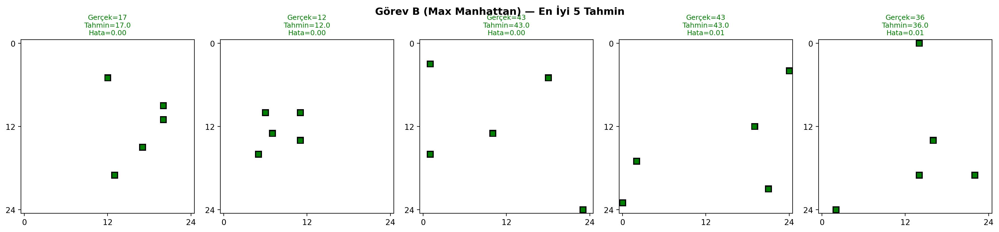
</p>
<p align="center"><em>Figure 25: Problem B — Best Predictions</em></p>

<p align="center">
  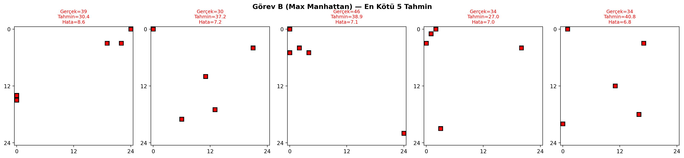
</p>
<p align="center"><em>Figure 26: Problem B — Worst Predictions</em></p>

---

### Problem C — Point Count Estimation

| Training Ratio | Training Samples | Epochs | Accuracy |
| -------------- | ---------------: | -----: | -------: |
| 25% | 900 | 27 | 0.412 |
| 50% | 1,800 | 41 | 0.792 |
| 100% | 3,600 | 73 | 0.951 |

Problem C yielded the best results among all problems. With 100% training data, the model reached approximately 95% accuracy.

The model performed better when the number of points was low. As the number of points increased, points became closer to each other and visual complexity increased, making counting more difficult.

The confusion matrix shows that classes 0–3 achieved 99–100% accuracy, while classes 7–9 dropped to 86–87%. This problem showed strong data hunger (41.2% → 79.2% → 95.1%).

<p align="center">
  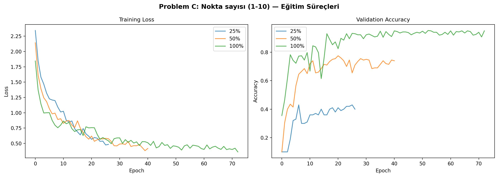
</p>
<p align="center"><em>Figure 27: Problem C — Training Curves</em></p>

<p align="center">
  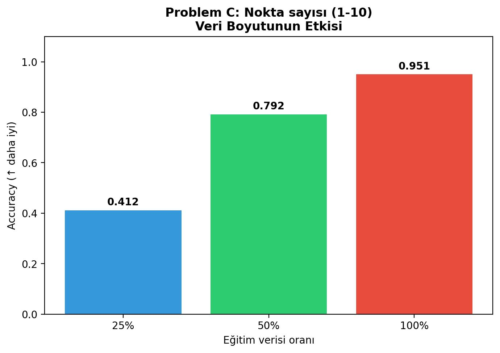
</p>
<p align="center"><em>Figure 28: Problem C — Performance by Training Ratio</em></p>

<p align="center">
  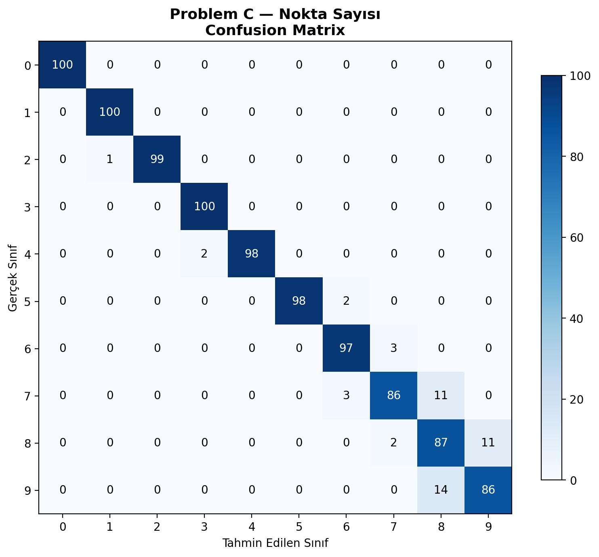
</p>
<p align="center"><em>Figure 29: Problem C — Confusion Matrix</em></p>

<p align="center">
  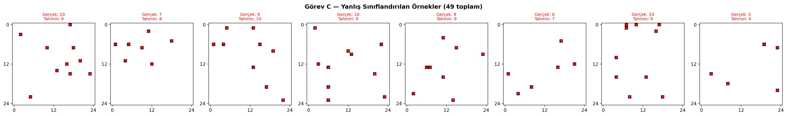
</p>
<p align="center"><em>Figure 30: Problem C — Misclassified Examples</em></p>

---

### Problem D — Odd / Even Classification

| Training Ratio | Training Samples | Epochs | Accuracy |
| -------------- | ---------------: | -----: | -------: |
| 25% | 360 | 32 | 0.567 |
| 50% | 720 | 22 | 0.493 |
| 100% | 1,440 | 38 | 0.512 |

The model showed its worst performance on Problem D. Accuracy remained around 50%, meaning the model produced results close to random guessing.

The fundamental reason for this failure is that odd/even classification is a global counting problem. CNN architectures primarily learn local features. Local features do not directly carry information about whether the total point count is odd or even.

Therefore, even with more training data, the model could not learn this problem. Training loss decreased during training, but validation accuracy stayed at approximately 50%.

<p align="center">
  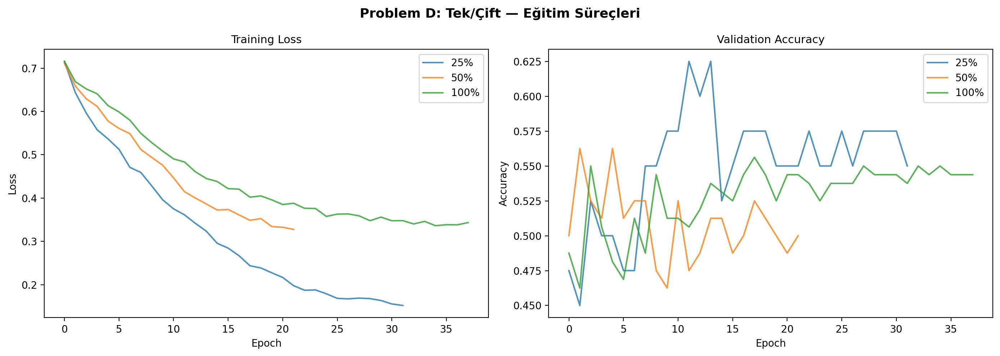
</p>
<p align="center"><em>Figure 31: Problem D — Training Curves</em></p>

<p align="center">
  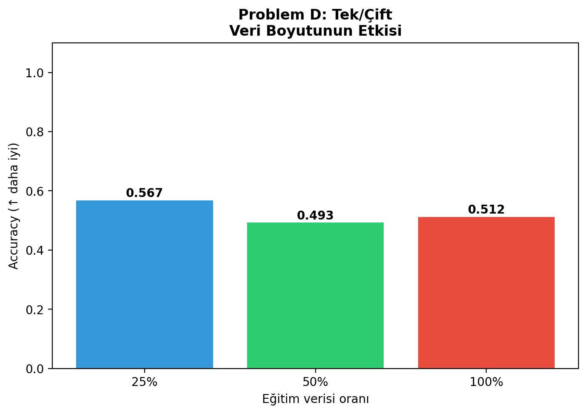
</p>
<p align="center"><em>Figure 32: Problem D — Performance by Training Ratio</em></p>

<p align="center">
  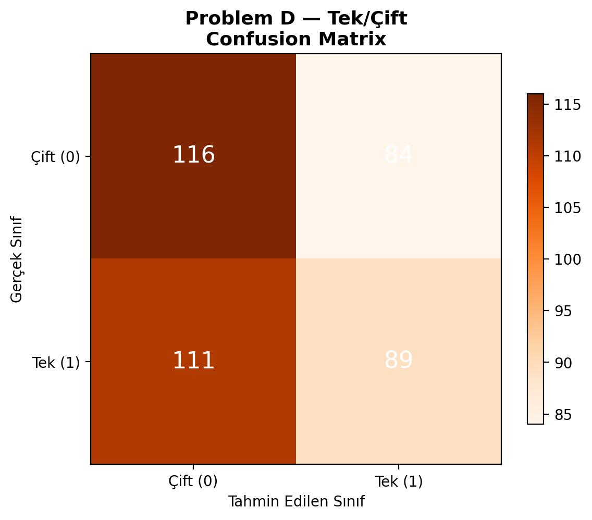
</p>
<p align="center"><em>Figure 33: Problem D — Confusion Matrix</em></p>

---

### Problem E — Corner Distance

| Training Ratio | Training Samples | Epochs | MAE | RMSE | R² |
| -------------- | ---------------: | -----: | --: | ---: | -: |
| 25% | 1,728 | 36 | 3.796 | 5.881 | 0.820 |
| 50% | 3,456 | 59 | 3.523 | 5.786 | 0.826 |
| 100% | 6,912 | 56 | 3.180 | 5.361 | 0.850 |

In Problem E, while the model was able to learn the distance concept, it showed limited success because it could not correctly determine odd/even parity.

This problem inherits the odd/even decision from Problem D, so the CNN architecture's inability to perform global counting negatively affected the results.

The model showed a clear MAE asymmetry: low target values had MAE 5–8 while high target values had MAE 0.3–1.5. The worst examples all showed measurements from the wrong corner.

<p align="center">
  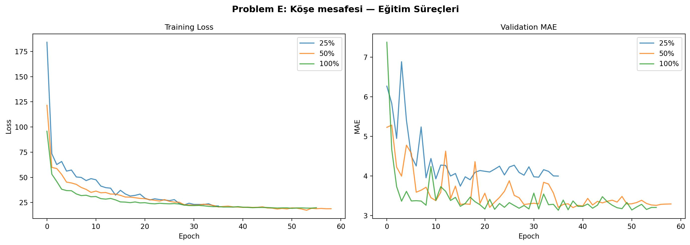
</p>
<p align="center"><em>Figure 34: Problem E — Training Curves</em></p>

<p align="center">
  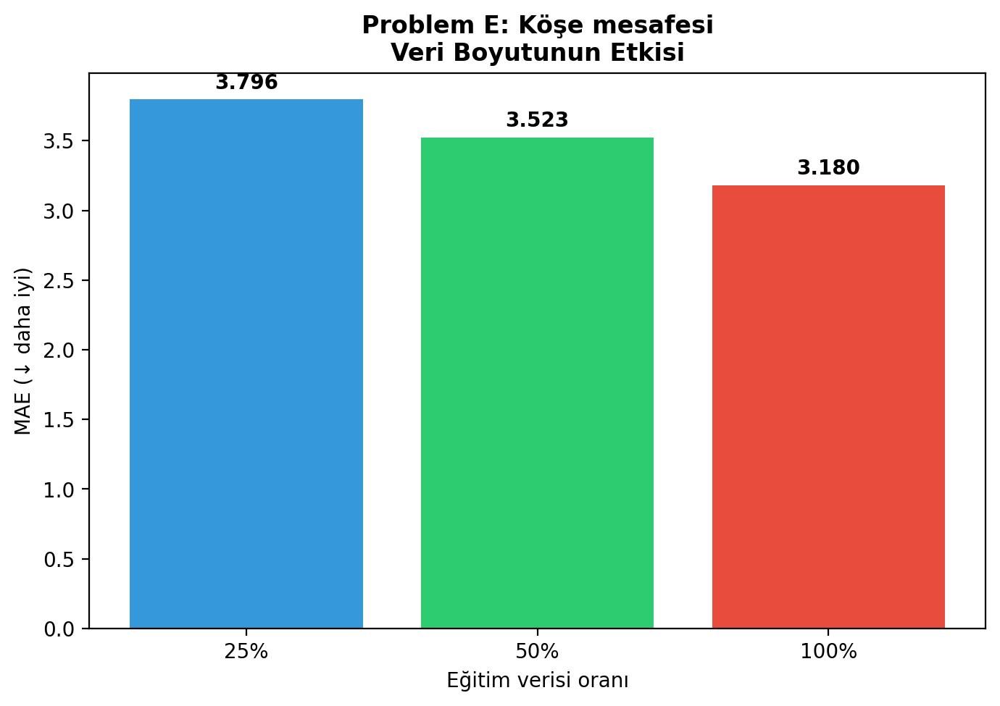
</p>
<p align="center"><em>Figure 35: Problem E — Performance by Training Ratio</em></p>

<p align="center">
  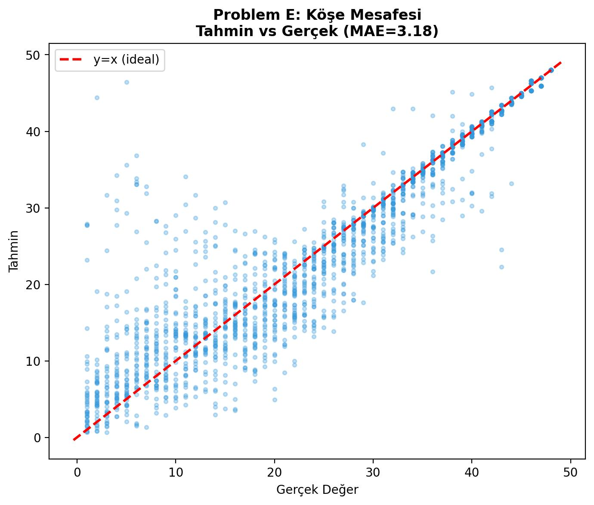
</p>
<p align="center"><em>Figure 36: Problem E — Predicted vs. Actual Values</em></p>

<p align="center">
  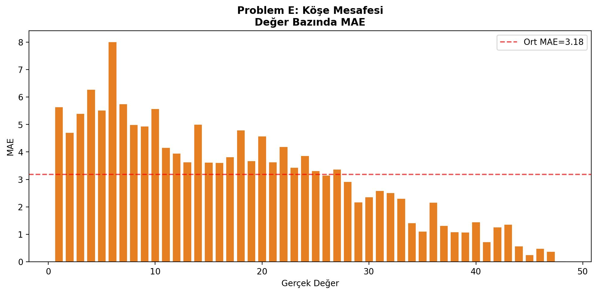
</p>
<p align="center"><em>Figure 37: Problem E — MAE by Target Value</em></p>

<p align="center">
  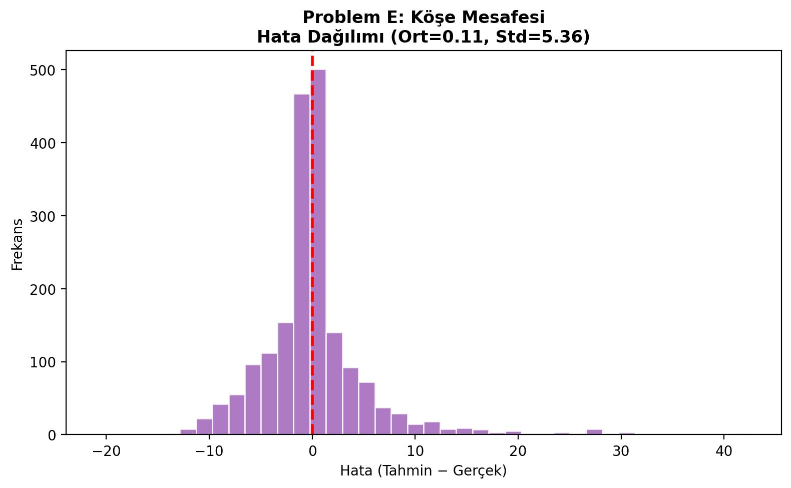
</p>
<p align="center"><em>Figure 38: Problem E — Error Distribution</em></p>

<p align="center">
  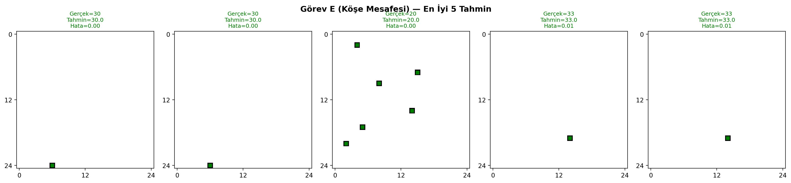
</p>
<p align="center"><em>Figure 39: Problem E — Best Predictions</em></p>

<p align="center">
  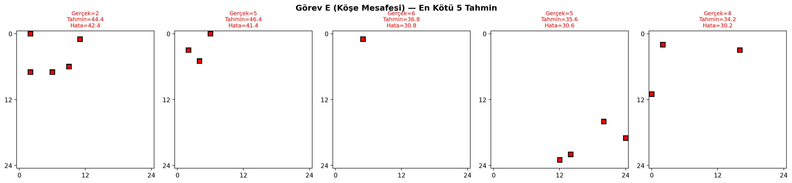
</p>
<p align="center"><em>Figure 40: Problem E — Worst Predictions</em></p>

---

## 5. Conclusion

### Summary Table

| Problem | Type | Metric | 25% | 50% | 100% |
| ------- | ---- | ------ | --: | --: | ---: |
| A — Min Manhattan Distance | Regression | MAE | 2.360 | 1.752 | 1.414 |
| B — Max Manhattan Distance | Regression | MAE | 2.431 | 1.890 | 1.648 |
| C — Point Count | Classification | Accuracy | 0.412 | 0.792 | 0.951 |
| D — Odd / Even | Classification | Accuracy | 0.567 | 0.493 | 0.512 |
| E — Corner Distance | Regression | MAE | 3.796 | 3.523 | 3.180 |

The results demonstrate that CNN architecture is successful at learning problems based on local patterns. The model produced meaningful results for Problems A, B, and C.

Problem B yielded more balanced results than Problem A because detecting the outermost points is sufficient for maximum Manhattan distance.

In Problem C, point count estimation was achieved with high accuracy. However, confusion between classes increased as the number of points grew.

Problem D is the most significant negative finding of this project. Since odd/even classification is a global counting problem, the CNN architecture was unable to learn this task.

In Problem E, although the model could learn the distance relationship, it produced significant errors at low distance values because it needed odd/even information to select the correct corner.

Overall, increasing training data improved performance for learnable problems (A, B, C, and E). However, for Problem D, which is structurally unlearnable by CNN architecture, increasing data did not produce meaningful improvement.

These results show that model success depends not only on the amount of data, but also on the structural suitability of the problem for the chosen neural network architecture.

---

## 6. Technologies

- **C** — Data generation
- **Python** — Model training and analysis
- **PyTorch** — Deep learning framework (CUDA, RTX 5060 Ti)
- **CSV** — Dataset format

> **Note:** The same base CNN architecture was used for all problems. For future work, Transformer, RNN, or attention-based architectures may yield better results for problems requiring global counting.

---
---

<div align="center">

# BLM 3510 — Yapay Zeka Projesi

### CNN Tabanlı Binary Matris Analizi

**Yıldız Teknik Üniversitesi — Bilgisayar Mühendisliği Bölümü**

---

</div>

## İçindekiler

1. [Veri Üretimi](#1-veri-üretimi)
2. [YSA Modeli](#2-ysa-modeli)
3. [Hiperparametre Optimizasyonu](#3-hiperparametre-optimizasyonu)
4. [Sonuçlar](#4-sonuçlar)
   - [Problem A — Minimum Manhattan Mesafesi](#problem-a--minimum-manhattan-mesafesi)
   - [Problem B — Maksimum Manhattan Mesafesi](#problem-b--maksimum-manhattan-mesafesi)
   - [Problem C — Nokta Sayısı Tahmini](#problem-c--nokta-sayısı-tahmini)
   - [Problem D — Tek / Çift Sınıflandırması](#problem-d--tek--çift-sınıflandırması)
   - [Problem E — Köşe Mesafesi](#problem-e--köşe-mesafesi)
5. [Sonuç](#5-sonuç)
6. [Teknolojiler](#6-teknolojiler)

---

## Genel Bakış

Bu projede 25×25 boyutunda binary matrisler üzerinde çalışan CNN tabanlı yapay sinir ağı modelleri geliştirilmiştir. Beş farklı problem tanımlanmış, veri setleri oluşturulmuş, modeller hiperparametre optimizasyonu ile eğitilmiş ve test sonuçları değerlendirilmiştir.

Projenin amacı, yapay sinir ağlarının farklı tipteki geometrik ve sayısal problemleri binary matris girdilerinden ne ölçüde öğrenebildiğini incelemektir. Matriste `1` değerleri noktaları, `0` değerleri boş alanları temsil etmektedir.

| Problem | Açıklama | Tip |
| ------- | -------- | --- |
| A | 5 sabit nokta arasındaki en yakın çiftin Manhattan mesafesi | Regresyon |
| B | 5 sabit nokta arasındaki en uzak çiftin Manhattan mesafesi | Regresyon |
| C | Nokta sayısının tahmini (1–10 nokta) | Sınıflandırma |
| D | Nokta sayısının tek/çift sınıflandırması | Sınıflandırma |
| E | Nokta sayısı tek ise sol üst köşeye, çift ise sağ alt köşeye en yakın noktanın köşeye Manhattan mesafesi | Regresyon |

---

## 1. Veri Üretimi

Veriler C dilinde yazılan program ile üretilmiştir. Her problem için 25×25 binary matrisler oluşturulmuş ve ilgili çıktı hesaplanarak CSV dosyalarına kaydedilmiştir.

Her veri satırı şu yapıdadır:

```text
{matris, çıktı}
```

### Problem A ve B

Problem A ve B için her matrise 5 adet nokta rastgele yerleştirilmiştir. Aynı konuma birden fazla nokta yerleştirilmemiştir. Problem A en yakın çiftin, Problem B ise en uzak çiftin Manhattan mesafesini hesaplar.

Manhattan mesafesi şu şekilde hesaplanır:

```text
|x1 - x2| + |y1 - y2|
```

Bu problemler için 10 milyon adet rastgele veri üretilmiştir. Ancak bazı uç değerlerin oluşma ihtimali çok düşük olduğu için tüm teorik aralıklarda eşit sayıda örnek elde edilememiştir. Bu nedenle veri setleri belirli aralıklara filtrelenmiş ve normalize edilmiştir.

| Problem | Değer Aralığı | Aralık Başına Örnek | Toplam Örnek |
| ------- | ------------: | ------------------: | -----------: |
| A       |          1–17 |                 200 |        3.400 |
| B       |          7–48 |                 200 |        8.400 |

<p align="center">
  
</p>
<p align="center"><em>Şekil 1: Problem A — Çıktı Değeri Dağılımı</em></p>

<p align="center">
  
</p>
<p align="center"><em>Şekil 2: Problem B — Çıktı Değeri Dağılımı</em></p>

<p align="center">
  
</p>
<p align="center"><em>Şekil 3: Problem A — Örnek Matrisler</em></p>

<p align="center">
  
</p>
<p align="center"><em>Şekil 4: Problem B — Örnek Matrisler</em></p>

### Problem C, D ve E

Problem C, D ve E için nokta sayısı 1 ile 10 arasında değişmektedir. Tüm değer aralıklarında yeterli sayıda veri üretilebildiği için ek filtreleme yapılmamıştır.

| Problem | Değer Aralığı | Aralık Başına Örnek | Toplam Örnek |
| ------- | ------------: | ------------------: | -----------: |
| C       |          1–10 |                 500 |        5.000 |
| D       |           0–1 |               1.000 |        2.000 |
| E       |          1–48 |                 200 |        9.600 |

<p align="center">
  
</p>
<p align="center"><em>Şekil 5: Problem C — Çıktı Değeri Dağılımı</em></p>

<p align="center">
  
</p>
<p align="center"><em>Şekil 6: Problem D — Çıktı Değeri Dağılımı</em></p>

<p align="center">
  
</p>
<p align="center"><em>Şekil 7: Problem E — Çıktı Değeri Dağılımı</em></p>

<p align="center">
  
</p>
<p align="center"><em>Şekil 8: Problem C — Örnek Matrisler</em></p>

<p align="center">
  
</p>
<p align="center"><em>Şekil 9: Problem D — Örnek Matrisler</em></p>

<p align="center">
  
</p>
<p align="center"><em>Şekil 10: Problem E — Örnek Matrisler</em></p>

### Eğitim / Test Ayrımı

Veri setleri %80 eğitim ve %20 test olacak şekilde ayrılmıştır. Test için ayrı veri üretilmemiştir.

Ayrıca modeller, eğitim verisinin farklı oranları kullanılarak eğitilmiştir:

- %25 eğitim verisi
- %50 eğitim verisi
- %100 eğitim verisi

| Problem | Toplam Veri | Eğitim | Test | %25 Eğitim | %50 Eğitim | %100 Eğitim |
| ------- | ----------: | -----: | ---: | ---------: | ---------: | ----------: |
| A       |       3.400 |  2.720 |  680 |        680 |      1.360 |       2.720 |
| B       |       8.400 |  6.720 | 1.680 |      1.680 |      3.360 |       6.720 |
| C       |       5.000 |  4.000 | 1.000 |      1.000 |      2.000 |       4.000 |
| D       |       2.000 |  1.600 |  400 |        400 |        800 |       1.600 |
| E       |       9.600 |  7.680 | 1.920 |      1.920 |      3.840 |       7.680 |

<p align="center">
  
</p>
<p align="center"><em>Şekil 11: Eğitim / Test Ayrımı</em></p>

<p align="center">
  
</p>
<p align="center"><em>Şekil 12: Veri Seti Özet Tablosu</em></p>

---

## 2. YSA Modeli

Giriş verisi iki boyutlu bir matris olduğu için CNN mimarisi tercih edilmiştir. Tüm problemler için aynı temel CNN mimarisi kullanılmış, yalnızca çıkış katmanı problem tipine göre değiştirilmiştir.

| Katman | Açıklama |
| ------ | -------- |
| Girdi | 25×25 binary matris |
| Conv2D | İlk özellik çıkarım katmanı |
| BatchNorm + ReLU | Normalizasyon ve aktivasyon |
| MaxPool2D | Uzamsal boyut azaltma |
| Conv2D | İkinci özellik çıkarım katmanı |
| BatchNorm + ReLU | Normalizasyon ve aktivasyon |
| MaxPool2D | Uzamsal boyut azaltma |
| Flatten | Düzleştirme |
| Linear + ReLU + Dropout | Tam bağlantılı katman |
| Linear | Çıkış katmanı |

### Çıkış Katmanları ve Kayıp Fonksiyonları

| Problem | Çıkış Katmanı | Kayıp Fonksiyonu |
| ------- | ------------- | ---------------- |
| A, B, E | 1 nöron | MSELoss |
| C | 10 nöron | CrossEntropyLoss |
| D | 1 nöron | BCEWithLogitsLoss |

---

## 3. Hiperparametre Optimizasyonu

Hiperparametre optimizasyonu için Grid Search yöntemi kullanılmıştır. Eğitim verisi kendi içinde %80 eğitim ve %20 doğrulama olarak ayrılmıştır.

Her kombinasyon belirli sayıda epoch boyunca eğitilmiş ve doğrulama setindeki başarıya göre en iyi hiperparametreler seçilmiştir.

### Arama Uzayı

| Parametre | Değerler |
| --------- | -------- |
| Learning Rate | 0.001, 0.0005, 0.0001 |
| Batch Size | 32, 64 |
| Conv Filters | (32, 64), (64, 128) |
| FC Size | 128, 256 |

Toplamda her problem için 8 farklı konfigürasyon denenmiştir.

### Seçim Kriterleri

| Problem Tipi | Seçim Kriteri |
| ------------ | ------------- |
| Regresyon | En düşük MAE |
| Sınıflandırma | En yüksek Accuracy |

### Eğitim Ayarları

| Parametre | Arama Aşaması | Eğitim Aşaması |
| --------- | ------------: | --------------: |
| Epoch | 20 | 150 |
| Early Stopping Patience | 10 | 20 |
| Optimizer | Adam | Adam |

Aşırı öğrenmeyi engellemek için Early Stopping kullanılmıştır. Eğitim verisinin %10'u doğrulama amacıyla ayrılmıştır.

### Seçilen En İyi Hiperparametreler

| Problem | Learning Rate | Batch Size | Conv Filters | FC Size |
| ------- | ------------: | ---------: | ------------ | ------: |
| A | 0.001 | 32 | (64, 128) | 256 |
| B | 0.0001 | 32 | (32, 64) | 256 |
| C | 0.001 | 64 | (64, 128) | 128 |
| D | 0.0001 | 64 | (64, 128) | 128 |
| E | 0.001 | 32 | (32, 64) | 128 |

---

## 4. Sonuçlar

### Problem A — Minimum Manhattan Mesafesi

| Eğitim Oranı | Eğitim Veri Adeti | Epoch | MAE | RMSE | R² |
| ------------ | ----------------: | ----: | --: | ---: | -: |
| %25 | 612 | 38 | 2.360 | 2.934 | 0.641 |
| %50 | 1.224 | 54 | 1.752 | 2.197 | 0.799 |
| %100 | 2.448 | 84 | 1.414 | 1.772 | 0.869 |

Model, en yakın Manhattan mesafesi problemini kabul edilebilir düzeyde öğrenebilmiştir. Eğitim verisi arttıkça tahmin performansı düzenli olarak iyileşmiştir.

Model özellikle 1–2 mesafe aralığında daha başarılı sonuçlar üretmiştir. Bunun nedeni, yakın nokta çiftlerinin CNN filtreleri tarafından daha kolay yakalanabilmesidir.

Daha büyük mesafelerde olası nokta yerleşimlerinin sayısı arttığı için varyans yükselmiş ve tahmin zorlaşmıştır.

<p align="center">
  
</p>
<p align="center"><em>Şekil 13: Problem A — Eğitim Eğrileri</em></p>

<p align="center">
  
</p>
<p align="center"><em>Şekil 14: Problem A — Eğitim Oranına Göre Performans</em></p>

<p align="center">
  
</p>
<p align="center"><em>Şekil 15: Problem A — Tahmin ve Gerçek Değerler</em></p>

<p align="center">
  
</p>
<p align="center"><em>Şekil 16: Problem A — Hedef Değere Göre MAE</em></p>

<p align="center">
  
</p>
<p align="center"><em>Şekil 17: Problem A — Hata Dağılımı</em></p>

<p align="center">
  
</p>
<p align="center"><em>Şekil 18: Problem A — En İyi Tahminler</em></p>

<p align="center">
  
</p>
<p align="center"><em>Şekil 19: Problem A — En Kötü Tahminler</em></p>

---

### Problem B — Maksimum Manhattan Mesafesi

| Eğitim Oranı | Eğitim Veri Adeti | Epoch | MAE | RMSE | R² |
| ------------ | ----------------: | ----: | --: | ---: | -: |
| %25 | 1.512 | 75 | 2.431 | 3.124 | 0.934 |
| %50 | 3.024 | 74 | 1.890 | 2.404 | 0.961 |
| %100 | 6.048 | 60 | 1.648 | 2.118 | 0.969 |

Problem B'de model, Problem A'ya göre daha dengeli sonuçlar üretmiştir. Bunun nedeni maksimum Manhattan mesafesi için modelin genellikle en uçtaki noktaları tespit etmesinin yeterli olmasıdır.

Eğitim verisi arttıkça MAE değeri azalmış ve modelin performansı iyileşmiştir.

En kötü tahminlerde 6.8–8.6 aralığında hatalar görülmüştür. Sistematik bir yanlılık yoktur — model hem fazla hem eksik tahmin üretmiştir.

<p align="center">
  
</p>
<p align="center"><em>Şekil 20: Problem B — Eğitim Eğrileri</em></p>

<p align="center">
  
</p>
<p align="center"><em>Şekil 21: Problem B — Eğitim Oranına Göre Performans</em></p>

<p align="center">
  
</p>
<p align="center"><em>Şekil 22: Problem B — Tahmin ve Gerçek Değerler</em></p>

<p align="center">
  
</p>
<p align="center"><em>Şekil 23: Problem B — Hedef Değere Göre MAE</em></p>

<p align="center">
  
</p>
<p align="center"><em>Şekil 24: Problem B — Hata Dağılımı</em></p>

<p align="center">
  
</p>
<p align="center"><em>Şekil 25: Problem B — En İyi Tahminler</em></p>

<p align="center">
  
</p>
<p align="center"><em>Şekil 26: Problem B — En Kötü Tahminler</em></p>

---

### Problem C — Nokta Sayısı Tahmini

| Eğitim Oranı | Eğitim Veri Adeti | Epoch | Accuracy |
| ------------ | ----------------: | ----: | -------: |
| %25 | 900 | 27 | 0.412 |
| %50 | 1.800 | 41 | 0.792 |
| %100 | 3.600 | 73 | 0.951 |

Problem C, en başarılı sonuç alınan problemdir. %100 eğitim verisi kullanıldığında model yaklaşık %95 doğruluğa ulaşmıştır.

Nokta sayısı düşük olduğunda model daha başarılıdır. Nokta sayısı arttıkça noktaların birbirine yaklaşması ve görüntüdeki karmaşıklığın artması nedeniyle sayım zorlaşmıştır.

Confusion Matrix incelendiğinde 0–3 sınıflarında %99–100 doğruluk, 7–9 sınıflarında ise %86–87'ye düşüş görülmüştür. Problem güçlü veri açlığı göstermiştir (%41.2 → %79.2 → %95.1).

<p align="center">
  
</p>
<p align="center"><em>Şekil 27: Problem C — Eğitim Eğrileri</em></p>

<p align="center">
  
</p>
<p align="center"><em>Şekil 28: Problem C — Eğitim Oranına Göre Performans</em></p>

<p align="center">
  
</p>
<p align="center"><em>Şekil 29: Problem C — Karışıklık Matrisi</em></p>

<p align="center">
  
</p>
<p align="center"><em>Şekil 30: Problem C — Yanlış Sınıflandırılan Örnekler</em></p>

---

### Problem D — Tek / Çift Sınıflandırması

| Eğitim Oranı | Eğitim Veri Adeti | Epoch | Accuracy |
| ------------ | ----------------: | ----: | -------: |
| %25 | 360 | 32 | 0.567 |
| %50 | 720 | 22 | 0.493 |
| %100 | 1.440 | 38 | 0.512 |

Model en kötü performansı Problem D'de göstermiştir. Doğruluk oranı yaklaşık %50 seviyesinde kalmış, yani model rastgele tahmine yakın sonuçlar üretmiştir.

Bu problemin başarısız olmasının temel nedeni, tek/çift ayrımının global bir sayma problemi olmasıdır. CNN mimarisi ağırlıklı olarak yerel özellikleri öğrenir. Yerel özellikler, nokta sayısının tek veya çift olduğu bilgisini doğrudan taşımaz.

Bu nedenle eğitim verisi artsa bile model bu problemi öğrenememiştir. Eğitim kaybı düşmesine rağmen doğrulama doğruluğu yaklaşık %50'de kalmıştır.

<p align="center">
  
</p>
<p align="center"><em>Şekil 31: Problem D — Eğitim Eğrileri</em></p>

<p align="center">
  
</p>
<p align="center"><em>Şekil 32: Problem D — Eğitim Oranına Göre Performans</em></p>

<p align="center">
  
</p>
<p align="center"><em>Şekil 33: Problem D — Karışıklık Matrisi</em></p>

---

### Problem E — Köşe Mesafesi

| Eğitim Oranı | Eğitim Veri Adeti | Epoch | MAE | RMSE | R² |
| ------------ | ----------------: | ----: | --: | ---: | -: |
| %25 | 1.728 | 36 | 3.796 | 5.881 | 0.820 |
| %50 | 3.456 | 59 | 3.523 | 5.786 | 0.826 |
| %100 | 6.912 | 56 | 3.180 | 5.361 | 0.850 |

Problem E'de model, mesafe kavramını öğrenebilmesine rağmen tek/çift ayrımını doğru yapamadığı için sınırlı başarı göstermiştir.

Bu problem, Problem D'deki tek/çift kararını da içerdiğinden CNN mimarisinin global sayma konusundaki yetersizliği sonuçları olumsuz etkilemiştir.

Model belirgin bir MAE asimetrisi göstermiştir: düşük hedef değerlerde MAE 5–8, yüksek hedef değerlerde 0.3–1.5. En kötü örneklerin tamamında yanlış köşeye göre ölçüm yapılmıştır.

<p align="center">
  
</p>
<p align="center"><em>Şekil 34: Problem E — Eğitim Eğrileri</em></p>

<p align="center">
  
</p>
<p align="center"><em>Şekil 35: Problem E — Eğitim Oranına Göre Performans</em></p>

<p align="center">
  
</p>
<p align="center"><em>Şekil 36: Problem E — Tahmin ve Gerçek Değerler</em></p>

<p align="center">
  
</p>
<p align="center"><em>Şekil 37: Problem E — Hedef Değere Göre MAE</em></p>

<p align="center">
  
</p>
<p align="center"><em>Şekil 38: Problem E — Hata Dağılımı</em></p>

<p align="center">
  
</p>
<p align="center"><em>Şekil 39: Problem E — En İyi Tahminler</em></p>

<p align="center">
  
</p>
<p align="center"><em>Şekil 40: Problem E — En Kötü Tahminler</em></p>

---

## 5. Sonuç

### Genel Sonuç Tablosu

| Problem | Tip | Metrik | %25 | %50 | %100 |
| ------- | --- | ------ | --: | --: | ---: |
| A — Min Manhattan Mesafesi | Regresyon | MAE | 2.360 | 1.752 | 1.414 |
| B — Max Manhattan Mesafesi | Regresyon | MAE | 2.431 | 1.890 | 1.648 |
| C — Nokta Sayısı | Sınıflandırma | Accuracy | 0.412 | 0.792 | 0.951 |
| D — Tek / Çift | Sınıflandırma | Accuracy | 0.567 | 0.493 | 0.512 |
| E — Köşe Mesafesi | Regresyon | MAE | 3.796 | 3.523 | 3.180 |

Elde edilen sonuçlar, CNN mimarisinin yerel örüntülere dayanan problemleri öğrenmede başarılı olduğunu göstermiştir. Model, Problem A, B ve C'de anlamlı sonuçlar üretmiştir.

Problem B, yalnızca en uçtaki noktaların tespitini gerektirdiği için Problem A'ya göre daha dengeli sonuçlar vermiştir.

Problem C'de nokta sayısı tahmini yüksek doğrulukla yapılabilmiştir. Ancak nokta sayısı arttıkça sınıflar arasındaki karışıklık da artmıştır.

Problem D, projenin en önemli negatif bulgusudur. Tek/çift belirleme problemi global bir sayma problemi olduğu için CNN mimarisi bu görevi öğrenememiştir.

Problem E'de ise model mesafe ilişkisini öğrenebilmesine rağmen doğru köşeyi seçebilmek için tek/çift bilgisine ihtiyaç duyduğundan düşük mesafe değerlerinde ciddi hatalar oluşmuştur.

Genel olarak eğitim verisinin artırılması, öğrenilebilir problemler olan A, B, C ve E'de performansı iyileştirmiştir. Ancak yapısal olarak CNN mimarisiyle öğrenilemeyen Problem D'de veri miktarının artması anlamlı bir iyileşme sağlamamıştır.

Bu sonuçlar, model başarısının yalnızca veri miktarına değil, problemin yapısına ve seçilen yapay sinir ağı mimarisine uygunluğuna da bağlı olduğunu göstermektedir.

---

## 6. Teknolojiler

- **C** — Veri üretimi
- **Python** — Model eğitimi ve analiz
- **PyTorch** — Derin öğrenme çerçevesi (CUDA, RTX 5060 Ti)
- **CSV** — Veri seti formatı

> **Not:** Tüm problemler için aynı temel CNN mimarisi kullanılmıştır. Gelecek çalışmalarda özellikle global sayma gerektiren problemler için Transformer, RNN veya attention tabanlı mimarilerin denenmesi daha başarılı sonuçlar verebilir.
